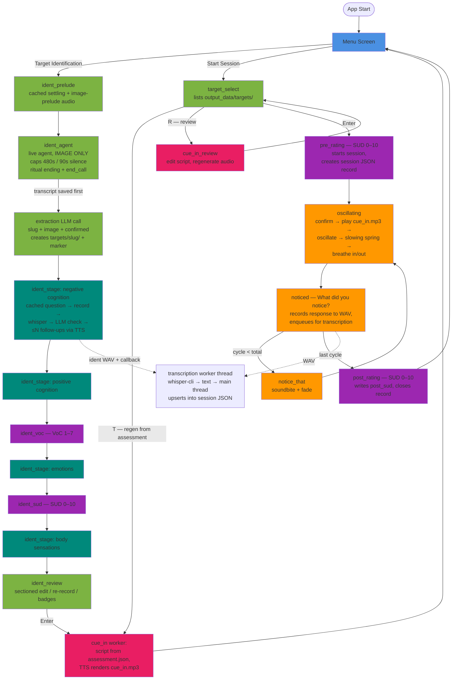

# EMDR3 - rewrite in Lua using the Love2D framework.

A therapeutic (E)ye (M)ovement (D)esensitisation & (R)eprocessing tool built with Lua and the LOVE2D framework.

## Planning mode

- At the end of each plan, give me a list of unresolved questions to answer, if any.

## Tech Stack
- **Language:** Lua
- **Framework:** LOVE2D (2D game framework); requires `t.audio.mic = true` in conf.lua for recording
- **Audio recording:** LOVE2D mic capture (`love.audio.getRecordingDevices()`)
- **Transcription:** whisper.cpp, local (`bin/whisper-cli` + `models/ggml-small.en.bin`, both gitignored), run in a background worker thread; also serves "raw" jobs (identification answers) via `transcription.enqueueRaw`
- **Target identification:** hybrid — ElevenLabs Conversational AI agent (real-time voice over WebSocket, `modules/agent*.lua`, `lib/websocket.lua`) scoped to **negotiating the target image only** (caps: 480 s max, 90 s silence), plus scripted assessment stages driven by cached TTS + whisper + LLM adequacy checks (`modules/identification.lua`, `screens/ident_*.lua`)
- **TTS:** ElevenLabs API; one voice everywhere (`config.ELEVENLABS_VOICE_ID`, Addison 2.0) — agent, cached audio, runtime TTS
- **LLM for checks/extraction/cue-in:** OpenAI or Anthropic, selected via `config.LLM_PROVIDER` / `config.LLM_MODEL`; generic worker `modules/llm.lua` + shared client `lib/llm_client.lua`
- **Editable prose:** every prompt and spoken script lives in files, never code strings — `prompts/*.md|txt` (agent prompt with sectioned `# Ritual ending`, per-stage check prompts grounded in `emdr_knowledge/positive_negative_cognitions.md`, extraction, cue-in) and `scripts/audio_generation/manifest.lua` (cached-audio texts). Agent prompt/first message are injected into the dashboard payload by `scripts/build_agent_payload.sh` (used by `update_agent.sh` / `create_agent.sh`)
- **Secrets:** `.env` at project root (gitignored), parsed by config.lua

## Context7 Documentation
Only use context7 when explicitly asked. Specify which library IDs to use per prompt.

Available library IDs:
- LOVE2D wiki: `/websites/love2d_wiki`
- ElevenLabs API: `/websites/elevenlabs_io`
- lua-http (HTTP requests): `/daurnimator/lua-http` (note: `lua-https` is not indexed in context7; use this as the closest alternative)
- whisper.cpp: `/ggml-org/whisper.cpp`
- Official OpenAI whisper: `/openai/whisper`

## Screen Flow

**Identification:** Menu → ident_prelude (cached settling + image-prelude audio) → ident_agent (live agent negotiates the image; ritual ending "Here is your final image…"; post-call LLM extraction creates the target folder) → ident_stage ×4 (negative cognition → positive cognition → … → emotions → … → body sensations; each = cached question → record → whisper → LLM check with ≤ `config.IDENT_MAX_FOLLOWUPS` follow-ups) with ident_voc (1–7) after PC and ident_sud (0–10) after emotions → ident_review (sectioned edit/re-record; badges for unconfirmed image / flagged stages) → confirm auto-generates cue-in → Menu.

**Processing:** Menu → Target Select → Pre-Rating (SUD) → Oscillating (confirm → cue-in audio → cycles) → Noticed → Notice That → … → Post-Rating (SUD) → Menu

Screens live in `screens/`, one module each, switched by the global `switchScreen(name)` in main.lua. `pre_rating`, `post_rating`, `ident_voc`, `ident_sud` are all produced by the parameterized factory `screens/rating.lua`. The identification step order/parameters live in `identification.steps` (`modules/identification.lua`); `ident_stage` is one screen serving all four spoken stages.

## Key Data Structures

**Per-session JSON record** — `output_data/targets/<slug>/sessions/session_<timestamp>.json`:

```json
{
  "session_id": "20260718_181433",
  "target": "awkward_puddle_moment",
  "started": "2026-07-18 18:14:33",
  "total_cycles": 6,
  "pre_sud": 4,
  "post_sud": 5,
  "completed": true,
  "responses": [ { "cycle": 1, "text": "..." } ]
}
```

- Responses are kept sorted by cycle; the design goal is that a researcher can read the user's narrative in order within a session, and stack all sessions under a target folder to follow a memory's processing over time. (This supersedes an older "linked list of responses" plan and the flat `output_data/session_*.txt` files, which remain on disk from pre-2026-07 sessions.)
- **Single-writer rule:** the **main thread** is the only writer of session records. Ratings/metadata are written directly by `modules/session_record.lua` the moment the user confirms them (instantly crash-safe). The whisper worker (`modules/transcription_thread.lua`) is a pure transcriber — WAV job in, text out over the status channel; it never touches record files. `modules/transcription.lua` receives each result on the main thread, upserts the response by cycle number (idempotent, out-of-order safe) via `modules/session_json.lua`, and only then deletes the WAV — so a crash at any point leaves the WAV on disk for re-transcription at next boot. (History: the worker used to be the writer, with ratings routed through its channel as `merge_record` messages; that made queued ratings die with the process in a crash — see CONSIDERATIONS #6, resolved 2026-07-18 by this flip.)

**Per-target assessment record** — `output_data/targets/<slug>/assessment.json` (written by `modules/assessment_json.lua`, main thread sole writer, write-through on every confirmation):

```json
{
  "version": 1, "target": "<slug>", "started": "…", "conversation_id": "…",
  "image": { "description": "…", "confirmed": true },
  "stages": { "negative_cognition": { "answer": "…", "flagged": false, "attempts": 2,
              "exchanges": [ { "question": "…", "response": "…" } ] },
              "positive_cognition": {}, "emotion": {}, "body": {} },
  "voc": 4, "sud": 7, "completed": false
}
```

- `image.confirmed=false` = the agent call capped out and extraction salvaged a best draft (review badges it). `flagged=true` = the stage exhausted its follow-up cap. `exchanges` preserves the full Q&A trail per stage.
- The raw agent transcript is saved to `output_data/target_image_<ts>.txt` **before** extraction runs (a completed call can never be lost), then copied to the target folder.

**Target folder** — `output_data/targets/<slug>/`: `transcript.txt` (raw agent conversation), `assessment.json` (above), `script.txt` (LLM cue-in script), `cue_in.mp3` (TTS audio), `sessions/` (records above).

## Application Flow



## Session Resume

A crashed **or** Escape-abandoned session is resumable (Escape = pause, by design). The runtime marker `resources/audio/transcription_queue/.session_ongoing` (gitignored) holds timestamp, last *completed* cycle, target dir/name, and total cycles; it's written at session start and after every saved response, and cleared only by the post-rating. When a valid marker exists, the menu prepends "Resume Session — <target> (cycle N/total)": resume restores the session, replays the confirm + cue-in to re-anchor, continues at lastCompleted + 1 (so responses keep their correct cycle numbers in the same JSON record), and routes straight to post_rating if all cycles were already done. Old two-line markers (pre target info) are rejected as unresumable. Pre-rating is intentionally skipped on resume — `pre_sud` was already recorded.

## Identification Resume

Identification is likewise resumable **after** the agent call — the call itself is not (a dropped call is redone; before extraction there is no marker and nothing durable). The marker `resources/audio/transcription_queue/.identification_ongoing` (3 lines: targetDir, targetName, started) is written the moment extraction creates the target folder, and cleared by review confirm or explicit discard. **Progress truth lives in `assessment.json`, not the marker**: resume derives the first incomplete step in flow order (nc → pc → voc → emotion → sud → body → review), so marker and record can never disagree. The menu shows "Resume Identification — <target> (<next step>)". Orphan WAVs in `ident_queue/` are swept on begin/resume — an answer only becomes durable when its check passes, so an interrupted stage replays its question.

## Session Notes & Handoffs

- `.claude/handoffs/` — end-of-session handoff docs (`YYYY-MM-DD.md`). Read the most recent one first when picking up work: it holds repo state, likely next work, and working conventions. Older handoffs go stale — when one contradicts this file or `git log`, trust the latter.
- `.claude/session_YYYY-MM-DD_*.md` — deep-dive notes on specific past debugging sessions (e.g. the agent connection fixes); historical reference, not current state.

## Known Loose Ends

- **Identification cached audio not yet generated** — `resources/audio/ident/*` (settling, interludes, questions, bridges) and `notice_that/` require a one-time user-run of `love scripts/audio_generation` (manifest-driven, ~$; skips existing files). All screens degrade gracefully to on-screen text until then.
- **Agent dashboard not yet synced** — the narrow agent config (`scripts/agent_workflow.json` + prompt injection) needs `bash scripts/update_agent.sh`, then `fetch_agent.sh` + diff to confirm the PATCH removed the old 10-node workflow graph (if the API merges instead of replacing, adjust and re-push; worst case `create_agent.sh` makes a fresh agent).
- **DEV: Stage Test** menu entry (stubbed image, jumps to nc stage) is deliberately still present for live testing; remove when the full flow is verified.
- **Audio files are not generated if they are missing on startup** (cue-in audio for old targets). `scripts/audio_generation/` covers the cached soundbites but is manual by design.
- `CONSIDERATIONS.md` and `TODO.md` (both gitignored, local-only) hold open quality notes. The old TII-agent improvement list in TODO.md is now largely superseded by the identification rebuild (see `specs/target_identification_flow.md`).

## Potential Optimisations

- **`noticed.lua` wdyn directory scan:** Currently rescans `resources/audio/wdyn/` on every `noticed.load()` call (~60 times per session). Cost is negligible on SSD with ≤10 files (~3ms/session total). Cache the file list at startup if: files exceed ~30–35, cycles exceed ~200, or running on a spinning HDD (threshold drops to ~2 files at ~1ms/scan).
