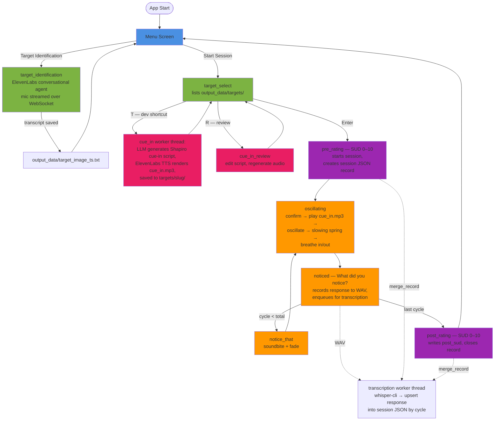

# EMDR3 - rewrite in Lua using the Love2D framework.

A therapeutic (E)ye (M)ovement (D)esensitisation & (R)eprocessing tool built with Lua and the LOVE2D framework.

## Planning mode

- At the end of each plan, give me a list of unresolved questions to answer, if any.

## Tech Stack
- **Language:** Lua
- **Framework:** LOVE2D (2D game framework); requires `t.audio.mic = true` in conf.lua for recording
- **Audio recording:** LOVE2D mic capture (`love.audio.getRecordingDevices()`)
- **Transcription:** whisper.cpp, local (`bin/whisper-cli` + `models/ggml-small.en.bin`, both gitignored), run in a background worker thread
- **Target identification:** ElevenLabs Conversational AI agent — real-time two-way voice over WebSocket (`modules/agent*.lua`, `lib/websocket.lua`)
- **TTS:** ElevenLabs API
- **LLM for cue-in script generation:** OpenAI or Anthropic, selected via `config.LLM_PROVIDER` / `config.LLM_MODEL` in config.lua
- **Secrets:** `.env` at project root (gitignored), parsed by config.lua

## Context7 Documentation
Only use context7 when explicitly asked. Specify which library IDs to use per prompt.

Available library IDs:
- LOVE2D wiki: `/websites/love2d_wiki`
- ElevenLabs API: `/websites/elevenlabs_io`
- lua-http (HTTP requests): `/daurnimator/lua-http` (note: `lua-https` is not indexed in context7; use this as the closest alternative)
- whisper.cpp: `/ggml-org/whisper.cpp`
- Official OpenAI whisper: `/openai/whisper`

## Screen Flow

Menu → Target Select → Pre-Rating (SUD) → Oscillating (confirm → cue-in audio → cycles) → Noticed → Notice That → … → Post-Rating (SUD) → Menu

Screens live in `screens/`, one module each, switched by the global `switchScreen(name)` in main.lua. `pre_rating` and `post_rating` are both produced by the factory `screens/rating.lua`.

## Key Data Structures

**Per-session JSON record** — `output_data/targets/<slug>/sessions/session_<timestamp>.json`:

```json
{
  "session_id": "20260718_181433",
  "target": "awkward_puddle_moment",
  "started": "2026-07-18 18:14:33",
  "total_cycles": 6,
  "pre_sud": 4,
  "post_sud": 5,
  "completed": true,
  "responses": [ { "cycle": 1, "text": "..." } ]
}
```

- Responses are kept sorted by cycle; the design goal is that a researcher can read the user's narrative in order within a session, and stack all sessions under a target folder to follow a memory's processing over time. (This supersedes an older "linked list of responses" plan and the flat `output_data/session_*.txt` files, which remain on disk from pre-2026-07 sessions.)
- **Single-writer rule:** the transcription worker thread is the only writer of session records. It transcribes queued WAVs and upserts each response by cycle number (idempotent, out-of-order safe). Rating/metadata writes from the main thread are routed through the same request channel as `{type = "merge_record"}` messages so all writes are serialized (`modules/session_record.lua` → `modules/transcription.lua` → `modules/transcription_thread.lua`). If whisper is unavailable the worker never starts and the main thread writes directly via `modules/session_json.lua` (shared, pure-Lua, requireable from both threads).

**Target folder** — `output_data/targets/<slug>/`: `transcript.txt` (raw TII conversation), `script.txt` (LLM cue-in script), `cue_in.mp3` (TTS audio), `sessions/` (records above).

## Application Flow



## Known Loose Ends

- **Session resume is half-built:** `session.writeOngoing()`/`clearOngoing()` maintain the runtime marker `resources/audio/transcription_queue/.session_ongoing`, but `session.resume()` and `session.getOngoing()` are never called — no screen offers to resume a crashed session. (Leftover WAVs *are* recovered and transcribed on next launch by `transcription.init`.)
- **Audio files are not generated if they are missing on startup** (wdyn/notice_that soundbites, cue-in audio). `scripts/audio_generation/` exists but is manual.
- `CONSIDERATIONS.md` and `TODO.md` (both gitignored, local-only) hold open quality notes and the TII-agent improvement list.

## Potential Optimisations

- **`noticed.lua` wdyn directory scan:** Currently rescans `resources/audio/wdyn/` on every `noticed.load()` call (~60 times per session). Cost is negligible on SSD with ≤10 files (~3ms/session total). Cache the file list at startup if: files exceed ~30–35, cycles exceed ~200, or running on a spinning HDD (threshold drops to ~2 files at ~1ms/scan).
