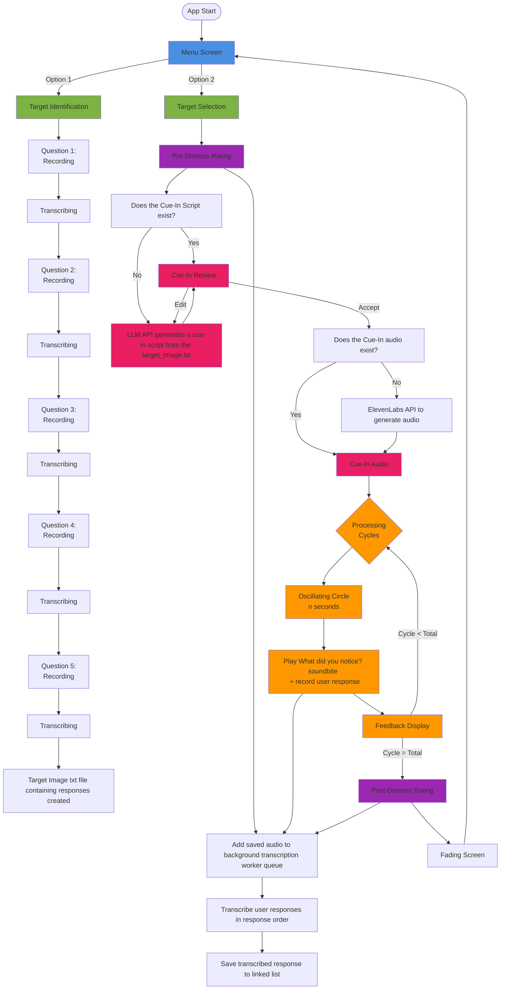

# EMDR3 - rewrite in Lua using the Love2D framework.

A therapeutic (E)ye (M)ovement (D)esensitisation & (R)eprocessing tool built with Lua and the LOVE2D framework.

## Planning mode

- At the end of each plan, give me a list of unresolved questions to answer, if any. 

## Tech Stack
- **Language:** Lua
- **Framework:** LOVE2D (2D game framework)
- **Audio recording service** Undecided
- **Transcription Service** Whisper (local, GPU if    
  available)   
- **TTS** ElevenLabs API                          
- **LLM for cue in script generation**  Undecided

## Context7 Documentation
Only use context7 when explicitly asked. Specify which library IDs to use per prompt.

Available library IDs:
- LOVE2D wiki: `/websites/love2d_wiki`
- ElevenLabs API: `/websites/elevenlabs_io`
- lua-http (HTTP requests): `/daurnimator/lua-http` (note: `lua-https` is not indexed in context7; use this as the closest alternative)

## Screen Flow

- Main menu → Target Image selection → pre user rating → cue in script → processing cycles → post user rating

## Key Data Structures
- We will save the users' responses in a linked list of {cycle, response_text} nodes

## Target Application Flow

## Potential Optimisations

- **`noticed.lua` wdyn directory scan:** Currently rescans `resources/audio/wdyn/` on every `noticed.load()` call (~60 times per session). Cost is negligible on SSD with ≤10 files (~3ms/session total). Cache the file list at startup if: files exceed ~30–35, cycles exceed ~200, or running on a spinning HDD (threshold drops to ~2 files at ~1ms/scan).
