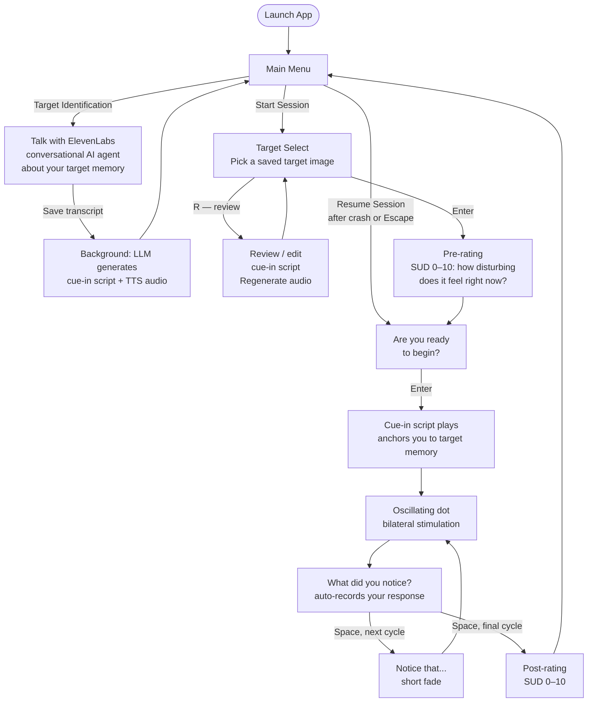
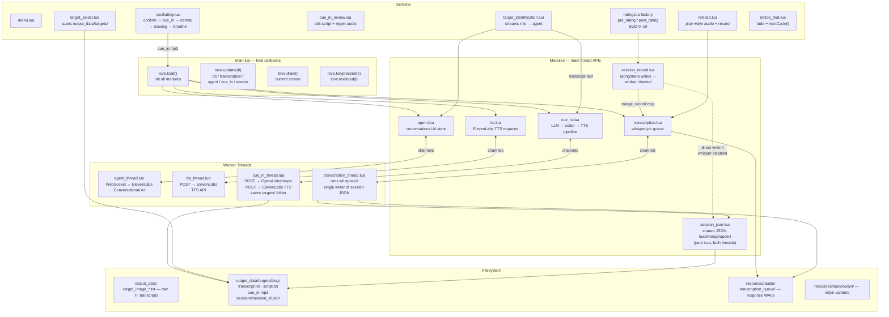

# EMDR3

A therapeutic Eye Movement Desensitisation & Reprocessing tool built with Lua and the LÖVE2D framework.

---

## User Experience Flow

---

## Technical Flow

---

## Session Log

### Session — 2026-07-18

**Pre/post SUD rating screens + per-target JSON session records**
- `screens/rating.lua` — factory producing `pre_rating` (after target select; starts the session) and `post_rating` (after the final cycle; closes the record). 0–10 scale, arrow/number keys.
- Session records moved from flat `output_data/session_*.txt` to `output_data/targets/<slug>/sessions/session_<id>.json` — self-describing (target, started, pre/post SUD, completed, responses sorted by cycle) so a researcher can follow the narrative within a session and stack sessions per target across time.
- `modules/session_json.lua` — shared pure-Lua load/merge/upsert helpers, required by both main thread and worker.
- `modules/session_record.lua` — main-thread API. Rating writes are routed through the transcription worker's channel (`merge_record` messages) so the worker remains the **single writer** of each record — no read-modify-write races between threads. Direct write fallback when whisper is disabled.
- Transcription worker now upserts responses into the JSON record (idempotent by cycle, out-of-order safe); crash recovery locates a recovered WAV's record by searching `targets/*/sessions/`.
- Untracked the runtime `.session_ongoing` marker and gitignored `resources/audio/transcription_queue/`.
- Live-verified with a full 6-cycle session.

**Session resume implemented** (was half-built: marker written but never read)
- Marker extended to timestamp / last *completed* cycle / target dir / name / total cycles. Fixes an off-by-one where a crash during cycle 1 would have resumed at cycle 2.
- Menu shows "Resume Session — <target> (cycle N/total)" when a valid marker exists; resume replays confirm + cue-in, continues at the correct cycle into the same JSON record, and goes straight to post-rating if all cycles were done. Escape mid-session = pause (resumable), by decision.
- `session.writeOngoing` now creates the queue dir itself (git had pruned the empty dir, which would have silently disabled markers when whisper is off).
- Merged `elevenlabs` → `main` (had never been pushed), then this work as `linked-list` → `main`; both branches deleted.

### Session — 2026-06-10

**WebSocket busy-spin fix (`lib/websocket.lua`)**
The `read_bytes` loop spun at 100% CPU on a single core while waiting for WebSocket data, because the `wantread`/`wantwrite` branch had no sleep. Fixed with `socket.sleep(0.001)` in that branch — drops idle CPU to near zero with negligible latency cost.

**Cue-in script generation pipeline**
Built the full pipeline from TII transcript → cue-in audio file:
- `modules/cue_in.lua` — main-thread API (same pattern as `tts.lua`)
- `modules/cue_in_thread.lua` — background worker: calls OpenAI (or Anthropic) to generate a Shapiro-protocol cue-in script + slug name, saves `output_data/targets/<slug>/`, then calls ElevenLabs TTS to produce `cue_in.mp3`
- LLM prompt follows Phase 4 Shapiro protocol: image → NC verbatim → body location, 1–3 sentences
- Config fields added: `LLM_PROVIDER`, `LLM_MODEL`, `ANTHROPIC_API_KEY`, `TARGETS_DIR`

**Target selection screen (`screens/target_select.lua`)**
Replaces the direct "Start Session → oscillating" flow. Scans `output_data/targets/` and lists available targets by slug name. `T` key triggers generation from the most recent transcript (dev shortcut).

**Cue-in review screen (`screens/cue_in_review.lua`)**
Lets the user read, edit (live typing), and regenerate the TTS audio for any saved target without re-running the LLM.

**Session start flow (`screens/oscillating.lua`)**
Added `"confirm"` and `"playing_cue_in"` phases before the first oscillation cycle. Shows "Are you ready to begin?" → Enter → plays `cue_in.mp3` → oscillation starts when audio finishes. Subsequent cycles skip straight to oscillation.

**Bug fix — oscillating screen re-showing confirm on every cycle**
`oscillating.load()` was entering `"confirm"` phase unconditionally, so every return from `notice_that` showed the confirmation screen again. Fixed by only entering `"confirm"` when `session.currentCycle <= 1`.
